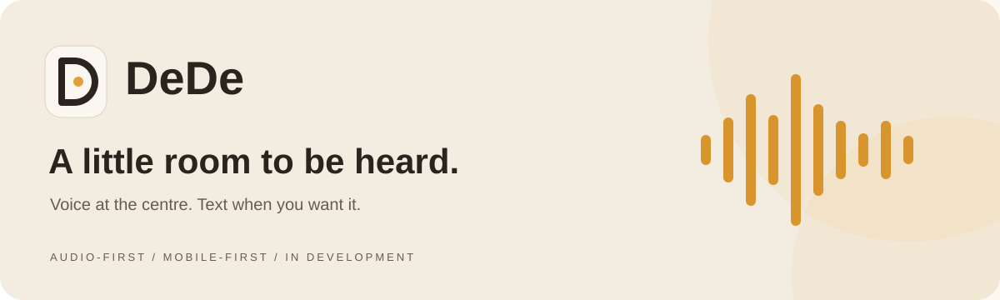
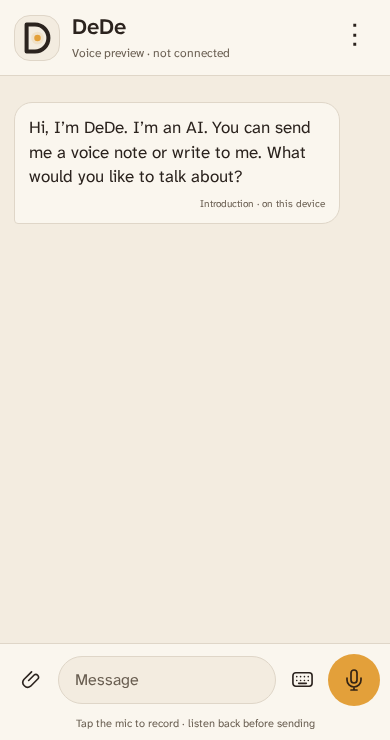
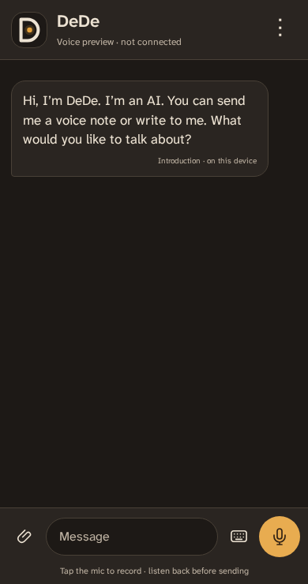

<div align="center">



# DeDe UI

An audio-first conversation space, designed to feel familiar on your phone.

[](package.json)
[](package.json)
[](compose.yaml)
[](TASKS.md)

[Quick start](#quick-start) · [The experience](#the-experience) · [How it works](#how-it-works) · [Roadmap](TASKS.md)

</div>

> **A working prototype, not a qualified release.** The current browser model is a reference model—not the trained DeDe student. Conversations live in tab memory and are **not backed up**. Do not use this build for emergency assistance or as the only copy of important information.

## The experience

One contact. One conversation. A microphone within reach.

- **Speak first.** Record, listen back and choose when to send. DeDe's replies have visible text and spoken audio by default; turn speech off in Settings.
- **Keep it familiar.** A mobile-first conversation layout, quiet colours and light, dark or system appearance.
- **Use other inputs when needed.** Type a message or attach an audio file. Photo and document understanding are still planned.
- **Sign in before sending.** Google authentication gates text and voice submission.
- **Adults only.** A separate 18+ self-declaration gates chat; clear first-person minor-age statements also stop reply generation. This is not age verification, and broader age-signal handling and encrypted age-state storage remain unfinished. Emergency-help instructions stay accessible, but this app cannot call or alert anyone.
- **Stay in control.** Explicit model downloads, cancellation and model-cache removal. No automatic fallback to Vast.

<div align="center">
  
  &nbsp;&nbsp;
  
</div>

<p align="center"><sub>Real browser-audit captures from the earlier onboarding build. These show the visual design; connection labels predate the current local runtime.</sub></p>

## Quick start

Use Docker for local development and testing. You do not need to install Node on the host.

```sh
git clone https://github.com/ma-za-kpe/dedeui.git
cd dedeui
docker compose up --build -d
```

Open **[localhost:3000](http://localhost:3000)**. The service binds to loopback only.

```sh
docker compose logs --tail 60 web   # Inspect the app
docker compose stop web           # Stop this app only
```

For source changes, rebuild and redeploy with `docker compose up --build -d`. This is a production-style container, not a hot-reload development server.

### Enable Google sign-in

The UI can open without Firebase configuration, but sending remains unavailable until sign-in succeeds.

1. Configure the Firebase Google provider and the appropriate authorized domain.
2. Supply `DEDE_FIREBASE_WEB_CONFIG` as a single-line JSON object in an external, owner-only environment file (`chmod 600`). Required client fields: `apiKey`, `authDomain`, `projectId` and `appId`.
3. Point Compose at that file:

```sh
DEDE_UI_ENV_FILE=/absolute/path/to/ui.env docker compose up --build -d
```

Firebase **web client configuration** is intentionally exposed to the browser. Service-account credentials, private keys and server secrets are not. Keep configuration files out of Git; never put private credentials in `NEXT_PUBLIC_*` variables. See the [authentication boundary](docs/local-inference.md#authentication-boundary).

After signing in, use Settings to download and load the local models. Microphone capture requires browser permission. A phone cannot reach the Mac through its own `localhost`; physical-device access needs a separately configured secure origin.

## How it works

```text
                     On the user's device

  Voice note → local transcription ─┐
                                   ├→ recent tab context → local language model
  Typed message ───────────────────┘                              │
                                                output checks ←──┘
                                                      │
                                           visible text + local speech
```

The worker uses **Transformers.js and single-threaded WebAssembly**. Public model files are downloaded at pinned revisions, ONNX weights are checksum-verified, and inference runs locally after loading. The model cache stores artifacts—not conversation backups.

| Component | Current implementation |
| --- | --- |
| Interface | Next.js App Router, React, TypeScript, Tailwind CSS |
| Authentication | Firebase Google sign-in; not vault encryption |
| Language | SmolLM2 135M reference model, Q4 |
| Listening | Whisper Tiny English, Q8 |
| Speaking | MMS English, Q8; non-commercial reference only |
| Conversation storage | In-memory tab state; lost on refresh or account changes |
| Server inference | Disabled; the former `/api/turn` proxy returns `410` |

**Performance and quality are not qualified.** CPU inference can be slow, replies can fail quality checks, and physical-phone memory, battery and thermal behaviour remain unmeasured. The current output filter is not the full backend law-enforcement graph. Production speech also requires a compatible licence. Read the [local-runtime details](docs/local-inference.md).

## Verification

Install the tracked pre-commit hook once per clone:

```sh
git config core.hooksPath .githooks
```

Every commit checks the exact staged Git snapshot in Docker: credential/path/size checks, zero-warning ESLint, all unit tests, an npm audit blocking high/critical vulnerabilities, and the production TypeScript/build gate. Missing Docker, registry failures or failed checks block the commit. No model requests or secrets are needed. GitHub Actions repeats the gate on pull requests and pushes to `main`. Local hooks can be bypassed; required branch-protection checks must be configured separately.

### GitHub Pages

Configured site: [ma-za-kpe.github.io/dedeui](https://ma-za-kpe.github.io/dedeui/).

Check [Pages deployment status](https://github.com/ma-za-kpe/dedeui/actions/workflows/pages.yml) for the published release. The URL returns 404 until the first successful deployment. For local development, use [localhost:3000](http://localhost:3000).

After a successful quality-gate run for a push/merge to `main`, the Pages workflow builds and deploys the **same commit** as a static site under `/dedeui`. It omits server routes; Google sign-in uses public web configuration supplied through the repository variable `DEDE_FIREBASE_WEB_CONFIG`. Enable GitHub Pages with GitHub Actions as its source, and authorize `ma-za-kpe.github.io` in Firebase before testing real sign-in. Without that configuration, the static UI remains signed out and cannot send.

Pages is for this experimental static demo, not a production SaaS backend. It cannot run the model, store the vault or reproduce the Docker server's response-security headers. Review [GitHub Pages usage limits](https://docs.github.com/en/pages/getting-started-with-github-pages/github-pages-limits) before production use. Model weights remain outside Git and outside the Pages artifact. A future experimental model download can use GitHub Release assets (under 2 GiB each), with licence, checksum and qualification receipts; download hosting does not provide inference or make GGUF compatible with the browser's ONNX runtime.

The Docker build runs ESLint and the production TypeScript/Next.js build. Run the HTTP smoke checks against the running container:

```sh
docker compose exec -T web node --input-type=module - < tests/smoke.mjs
```

Run focused unit tests in Docker:

```sh
docker run --rm -v "$PWD:/app:ro" -w /app node:22-bookworm-slim \
  node --experimental-strip-types --test 'tests/*.test.mjs'
```

The suite includes audio-format validation, local-output checks, model-integrity handling, Firebase configuration import and onboarding text. Browser tests cover layout, signed-out rejection and audio playback. Real-model integration is a separate, explicit test requiring downloaded weights and a synthetic audio fixture; unit tests are not proof of model quality, real Google OAuth or physical-device readiness.

## What's next

| In this prototype | Still to qualify or build |
| --- | --- |
| Audio-first layout and themes | Physical-device recording, playback and accessibility |
| Local text/STT/TTS runtime | Fast, law-qualified student and production voice |
| Tab-local conversation context | Grounded memory, notes and encrypted persistence |
| Google sign-in UI | Real-account lifecycle and future backend authorization |
| PWA manifest and offline notice | Signed model updates, recovery and rollback |
| No workshop upload fallback | Encrypted R2 sync, verified restore and consented beacons |

The [task ledger](TASKS.md) records evidence and unfinished work. A checked test is not a promise that every layer is ready.

## Explore

- [Local inference, model pins and privacy boundaries](docs/local-inference.md)
- [Household UI design audit](docs/household-ui-audit.md)
- [Firebase + R2 architecture proposal](docs/firebase-r2-plan.md)
- [Backend repository](https://github.com/ma-za-kpe/dedecorebackend)

Brand assets live in [`public/brand`](public/brand). The bundled Atkinson Hyperlegible Next font includes its [OFL licence](public/fonts/OFL-Next.txt). Model licences are separate; this repository does not grant additional rights to model weights.

<div align="center">
  
  <p><sub>Voice at the centre. The rest within reach.</sub></p>
</div>
